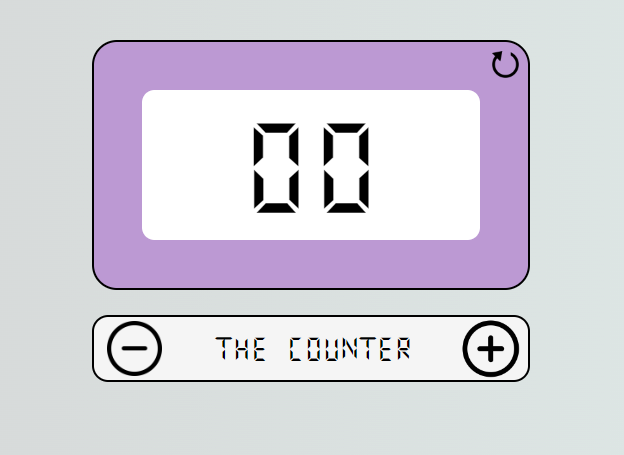

# Points Counter

## Table of Contents
* [Description](#description)
* [Languages](#languages)
* [Try It!](#try-it)
* [License](#license)
* [Author](#author)

## Description
This is my first JavaScript project, the app is basically a counter that can be used to keep tracks of points.

As school assignment one of the requirement was to build the counter buttons with JavaScript. 
I decided to build the whole page content with JavaScript since I like that it does it with a single function.  

If you want to fork the project for a personal usage, you can remove the [code](assets/js/script.js#L84-L94) that builds the page content automatically and uncomment the body elements in [index.html](index.html#L27-L42).

## Languages
   

## Try It!
You can try this simple app [HERE](https://tangerine-babka-eeeee1.netlify.app/)!

Alternatively, you can [download](https://github.com/cavaliernicola/Points-Counter/archive/refs/heads/main.zip) the project folder on your device and open the [`index.html`](index.html) file.

## License
Distributed under the MIT License. See [`LICENSE`](LICENSE) for more information.

## Contact Me
* Author: Nicola Cavalier 
* Email: cavaliernicola@gmail.com
